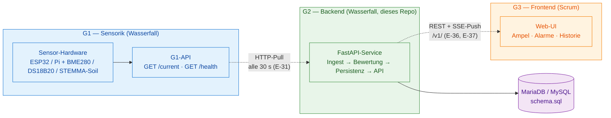
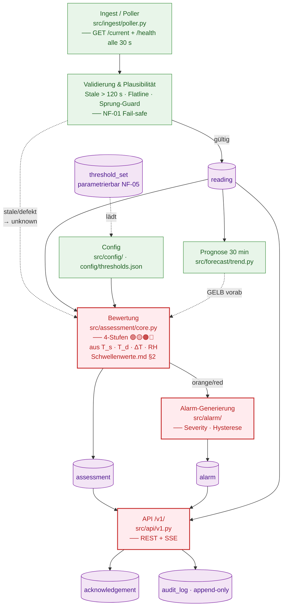
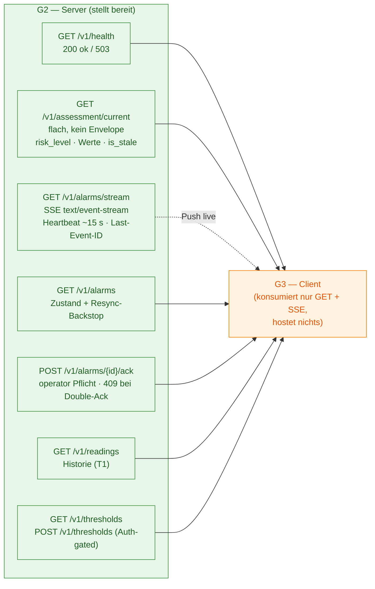
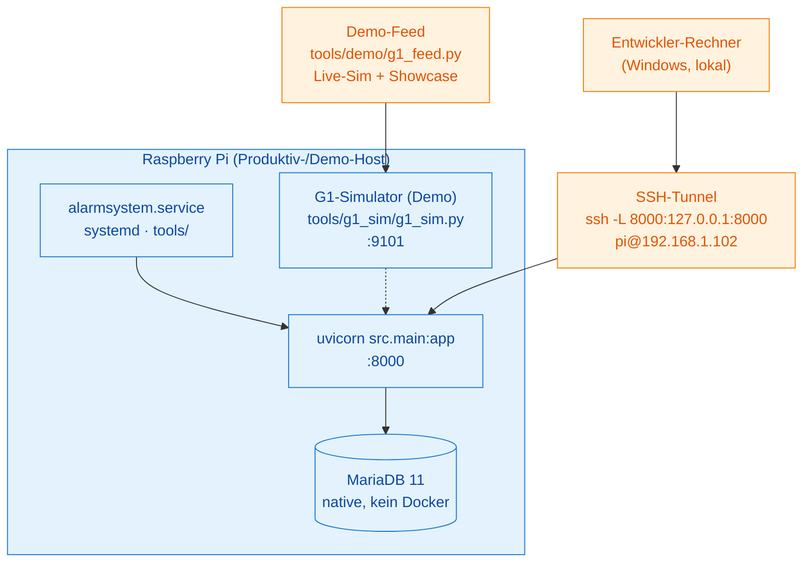

# Architekturdiagramm — Vereisungserkennung ANR (G2 Backend)

> **Zweck:** Einziges verbindliches, nachzeichnungsfähiges Architekturdiagramm für Präsentation,
> Doku und Onboarding. Ersetzt die ASCII-Skizze aus `Backend-Konzept.md` §2 und das WhatsApp-Photo
> in `assets/` durch eine versionierbare, auf GitHub nativ gerenderte Mermaid-Darstellung.
>
> **Quellen (belegbasiert, nichts erfunden):**
> `Backend-Konzept.md` §1–§9 · `04-Source-code/README.md` (Datenfluss, Naht) ·
> `04-Source-code/docs/API_FROZEN_v1.md` · `Schwellenwerte.md` ·
> Entscheidungslog E-29/E-31/E-35/E-36/E-37/E-44.
>
> **Scope:** G2 = Backend (dieses Repo). G1 (Sensorik) und G3 (Frontend) nur als Naht-Partner
> gezeigt — nicht mitkonzipiert. Für Folien: Mermaid-Block als Screenshot oder via
> `mermaid-cli` (`mmdc -i ... -o ...png`) exportieren.

---

## 1. Systemkontext — Gruppen, Nähte, Datenrichtung

Drei Gruppen, **zwei Nähte** — beide gehören fachlich G2. G1 wird **gepollt** (G2 = Client),
G3 wird **bespielt** (G2 = Server).

**Methoden-Vergleich (Kursziel):** G1 & G2 arbeiten nach **Wasserfall** (Sequence: Anforderung →
Design → Implementierung → Test), G3 nach **Scrum** (Sprints, Daily Standup). Diese bewusste
Parallelität ist Teil der Lernaufgabe und in der Präsentation als Teamorganisations-Kriterium
zu zeigen.

---

## 2. Backend-Intern — Modul-Fluss und kritischer Pfad

Die Innenstruktur von G2. **Kritischer Pfad** (rot): Ingest → Persistenz → Bewertung → Serving
→ Alarm → Ack, end-to-end verifiziert (`erinnerung/architektur-tiefenaudit-2026-06-30.md`).

---

## 3. API-Naht (eingefroren) — G2 stellt bereit, G3 konsumiert

Der **eingefrorene Contract v1.0** (DTB-26, P1.4). Wire-Form stabil; Breaking Changes laufen
nur über `/v2/`, nie über ein Brechen von `/v1/`. Source of Truth: `docs/API_FROZEN_v1.md` +
`docs/api/v1/openapi.yaml`.

**Fail-safe-Invarianten (NF-01, am Serving-Punkt hart durchgesetzt):**
`green` nur bei `is_stale=false` **und** `sensor_status=ok` · Stale **oder** `fault` → `unknown`
(nie GRÜN) · „keine Daten" → `503`, nicht `null`.

**RB-01:** `POST /v1/alarms/{id}/ack` ist reine UI-/Audit-Quittierung — **kein** Aktor, **keine**
Startbahn-Freigabe/Sperr-Endpoint existiert.

---

## 4. Deployment — Pi-Hosting

Betriebsmodell: **Raspberry Pi** als Host, native MariaDB (kein Docker → E-35), systemd-Service.
G1 im Echtbetrieb Sensor-Hardware, im Demo-Betrieb der G1-Simulator (`tools/g1_sim/`).

---

## 5. Technologie-Stack (Spalte pro Baustein)

| Baustein | Wahl | Begründung / ADR |
|---|---|---|
| Sprache / Framework | Python ≥ 3.12 · **FastAPI** · Pydantic | schnelle REST + Validierung (E-08) |
| DB | **MySQL / MariaDB** (native) | GL-Vorgabe (E-29); kein Docker (E-35) |
| DB-Zugriff | **rohes PyMySQL** + Repository-Pattern | kein ORM, parametrisierte Queries (E-35) |
| Migrationen | handgeschriebenes `schema.sql` | kein Alembic (E-35) |
| G1 → G2 | **HTTP-Pull** (30 s) | G2 = Client (E-31) |
| G2 → G3 | **REST + SSE** | Push für Alarme (E-37), eine API unter `/v1/` (E-36) |
| Testen | **pytest · ruff** | Bewertungslogik ≥ 80 % Coverage |

---

*Lebendes Dokument — bei Architektur-Änderung (neues Modul, neue Naht, Stack-Wechsel) dieses
Diagramm und die referenzierten Quellen (`Backend-Konzept.md`, `README.md`, `API_FROZEN_v1.md`)
gemeinsam nachziehen. Pflege: G2-Architekt.*
